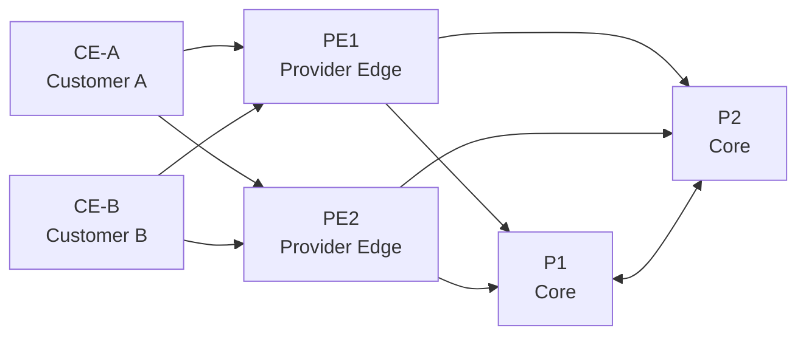

# ResilientCore Lab

**Independent carrier-network portfolio lab by Erica Nordlöf**

ResilientCore Lab is a hands-on network design, automation and troubleshooting project that models a small service-provider core with redundancy, routing, MPLS concepts, VPN segmentation, validation and operational documentation.

> This is a portfolio and learning lab, not a claim of production experience or an implementation used by Teracom or any other operator.

## What the project demonstrates

- Provider-style topology with **PE / P / CE** roles
- **IS-IS** underlay and loopback reachability
- **MPLS / Segment Routing design concepts**
- **MP-BGP L3VPN** and VRF separation
- Design notes for **L2VPN / EVPN / VPWS / VPLS**
- High availability and dual-path thinking
- Network security and segmentation principles
- **Ansible** inventory and validation playbooks
- Third-line troubleshooting runbooks
- Change planning, rollback, risk and cost-estimate templates
- A lightweight operations dashboard fed by sample telemetry
- CI validation of project data and configuration structure

## Architecture



### Logical layers

1. **Underlay:** IS-IS advertises loopbacks and transit links.
2. **Transport:** SR-MPLS/LDP concepts provide label-switched forwarding.
3. **Overlay:** MP-BGP distributes VPN routes between PE nodes.
4. **Services:** VRFs isolate customer routing; L2VPN alternatives are documented.
5. **Operations:** Automation validates routing adjacencies, redundancy and service state.

## Repository structure

```text
.
├── dashboard/            # browser-based NOC-style project dashboard
├── data/                 # sample telemetry/state
├── docs/                 # design, security, change and incident documentation
├── lab/                  # containerlab topology and FRR-style configs
├── ansible/              # automation examples
├── scripts/              # validation tooling
└── .github/workflows/    # CI checks
```

## Quick start: dashboard

Open `dashboard/index.html` in a browser, or serve the repository locally:

```bash
python3 -m http.server 8080
```

Then open `http://localhost:8080/dashboard/`.

## Quick start: validation

```bash
python3 scripts/validate_network_state.py data/network-state.json
```

Expected result:

```text
PASS: 6 nodes checked
PASS: all core adjacencies are up
PASS: all required VRFs are present
PASS: redundancy target satisfied
```

## Optional network emulation

The `lab/topology.clab.yml` file is designed as a portfolio topology for use with Containerlab and FRRouting-compatible containers. Image names may need to be adjusted to your local environment.

Typical workflow:

```bash
containerlab deploy -t lab/topology.clab.yml
ansible-playbook -i ansible/inventory.yml ansible/playbooks/validate.yml
containerlab destroy -t lab/topology.clab.yml
```

## Design decisions

### Why IS-IS?

IS-IS is common in service-provider cores because it scales well, is topology-oriented and is independent of IP transport for protocol operation. The lab uses it as the conceptual IGP underlay.

### Why MP-BGP + VRFs?

MP-BGP separates customer routes from the provider core and distributes VPN routing information between PE routers. VRFs provide segmentation and overlapping-address support.

### Why automation?

Manual validation does not scale. The automation layer is designed to verify expected state before and after a change: routing neighbors, VRFs, redundancy and service health.

## Operational mindset

Every network change in this project follows the same pattern:

1. Define intended state.
2. Record assumptions and dependencies.
3. Validate pre-change health.
4. Apply change in a controlled scope.
5. Validate routing and service state.
6. Roll back if acceptance criteria fail.
7. Update documentation.

## Portfolio positioning

**CV description:**

> ResilientCore Lab — independent carrier-network engineering lab. Designed a redundant PE/P/CE topology with IS-IS underlay, MPLS/Segment Routing concepts, MP-BGP L3VPN/VRF segmentation, Ansible-based validation, third-line troubleshooting runbooks, security design, change/rollback plans and a lightweight NOC dashboard.

**Technologies / concepts:** IS-IS, OSPF comparison, MPLS, SR-MPLS, LDP, SRv6, MP-BGP, L3VPN, EVPN, VPWS, VPLS, VRF, Ansible, Python, Containerlab, FRRouting, GitHub Actions.
