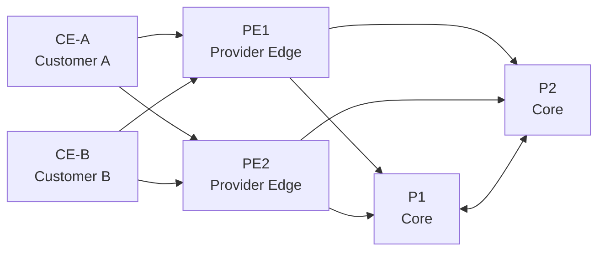

# ResilientCore Lab

**Independent carrier-network engineering portfolio lab by Erica Nordlöf**

ResilientCore Lab is a hands-on design, automation and troubleshooting project that models a small provider-style network with redundancy, routing, VPN segmentation, validation and operational documentation.

> This is a portfolio and learning lab. It is not a claim of production operator experience and is not affiliated with Teracom or any other network operator.

## What the project demonstrates

- Provider-style **PE / P / CE** architecture
- **IS-IS** underlay and redundant path design
- **MPLS / Segment Routing** engineering concepts
- **MP-BGP L3VPN** and VRF segmentation concepts
- Design notes for **EVPN / VPWS / VPLS / SRv6 / LDP**
- High availability and failure-domain thinking
- Network and management-plane security principles
- **Ansible** operational validation examples
- **Python** validation of expected network state
- Third-line troubleshooting runbooks
- Change planning, rollback, risk and cost-estimate templates
- NOC-style dashboard driven by sample telemetry
- GitHub Actions validation

## Architecture



### Logical layers

1. **Underlay:** IS-IS provides provider-core reachability.
2. **Transport:** MPLS/SR concepts describe label-switched transport and resilient forwarding.
3. **Overlay:** MP-BGP distributes VPN reachability between PE nodes.
4. **Services:** VRFs isolate customer/service routing contexts.
5. **Operations:** validation, change control, rollback and incident workflows protect service availability.

## Repository structure

```text
.
├── README.md
├── render.yaml
├── dashboard/
│   ├── index.html
│   ├── styles.css
│   ├── app.js
│   └── network-state.json
├── data/
│   └── network-state.json
├── docs/
├── lab/
├── ansible/
├── scripts/
└── .github/workflows/
```

## Dashboard — local run

Do not open `dashboard/index.html` directly with `file://`, because browsers can block local `fetch()` requests. Serve the repository through a local HTTP server instead:

```bash
python3 -m http.server 8080
```

Then open:

```text
http://localhost:8080/dashboard/
```

## Dashboard — Render static site

The dashboard is self-contained and safe to publish as a static site.

Manual Render settings:

```text
Service type:      Static Site
Branch:            main
Root Directory:    (blank)
Build Command:     (blank)
Publish Directory: dashboard
```

A `render.yaml` Blueprint is also included.

The dashboard loads:

```text
./network-state.json
```

so it does not depend on files outside the published directory.

## Validation

Run:

```bash
python3 scripts/validate_network_state.py data/network-state.json
```

Expected result:

```text
PASS: 6 nodes checked
PASS: all core adjacencies are up
PASS: all required VRFs are present
PASS: redundancy target satisfied
```

GitHub Actions also validates JSON syntax, JavaScript syntax, required documentation and that the dashboard copy of the sample state matches the canonical data file.

## Optional network emulation

`lab/topology.clab.yml` and the FRRouting-style configuration files provide a shareable reference lab structure for Containerlab/FRR-compatible environments.

Advanced MPLS/SR and VPN features vary by platform, kernel capabilities and FRR/container environment. See `docs/lab-scope.md` before presenting or extending the lab.

Typical workflow:

```bash
containerlab deploy -t lab/topology.clab.yml
ansible-playbook -i ansible/inventory.yml ansible/playbooks/validate.yml
containerlab destroy -t lab/topology.clab.yml
```

## Operational mindset

Every change is structured around:

1. intended state and dependencies;
2. pre-change evidence;
3. controlled implementation scope;
4. routing and service validation;
5. explicit rollback criteria;
6. post-change evidence and documentation.

## Portfolio positioning

**Suggested CV description:**

> **ResilientCore Lab — Carrier Network Engineering Portfolio Lab.** Designed a redundant PE/P/CE architecture with IS-IS underlay, MPLS/Segment Routing and MP-BGP L3VPN concepts, VRF segmentation, Ansible/Python validation, change and rollback planning, network-security documentation and third-line troubleshooting workflows.

**Technologies and concepts:** IS-IS, OSPF comparison, MPLS, SR-MPLS, LDP, SRv6, MP-BGP, L3VPN, EVPN, VPWS, VPLS, VRF, Ansible, Python, Containerlab, FRRouting and GitHub Actions.

See `docs/interview-positioning.md` and `docs/lab-scope.md` for honest presentation boundaries.
